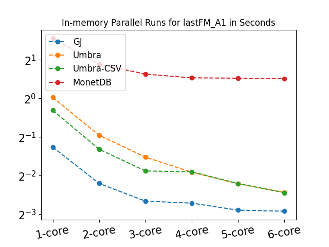
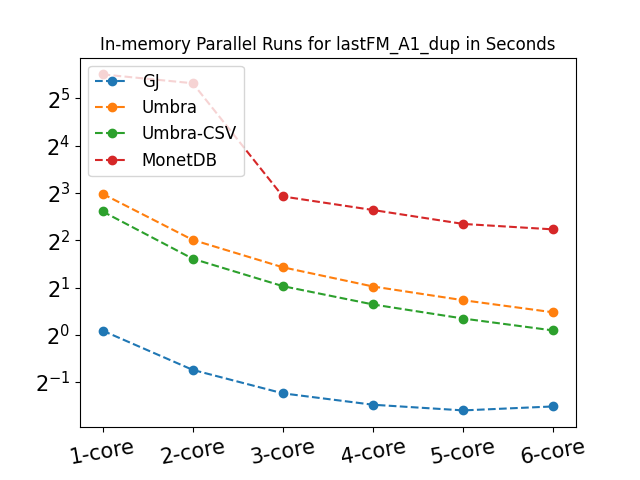

We present our parallel version of GJ algorithm to join the relational tables by using graphical models.  

The code is for lastFM-A1, lastFM-A1-dup and lastFM-A2 queries. To see the queries and other settings, please refer to our new paper " Graphical Join, To Be Available Soon".

The results for in-memory and in-disk runs for the three queries are shown below. The results show that GJ has a better performance even in parallel setting.  

There are several phases of SGJ algorithm. 
i) Loading the data in memory 2)Scanning the tables to make the potential functions ii) Variable elimination/deletion (inference) and building the GFJS generator. iv) Traversing the GFJS generator to generate the summary 
v)Storing the summary on disk vi) Loading the summary and de-summarization.

Only part of GJ that is not embarrassingly parallelizable is the inference. The inference algorithm is partially sequential, but there are several works that make VEA efficiently parallelizable (topological parallelization and in-clique parallelization). Please have a look at the papers:  
https://dl.acm.org/doi/10.5555/602770.602830  
https://link.springer.com/chapter/10.1007/978-3-642-03275-2_37  

As GJ stores the summary of the join result, it is a CPU-bound join algorithm, while other algorithms spend a lot of time to store huge join results in disk.  
 
The Y axis in the below figures is the running time in seconds, and the X axis shows the number of cores.

      
